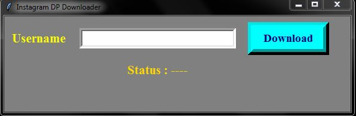

# Instagram-DP-Downloader

### A python based app used to download profile pic of any insta user.


### Requirements:

Install the module by running the given command in your cmd.

```
pip install instaloader
```

-  Run the program app.py
- Input the username
- File will be downloaded in your default App location.



